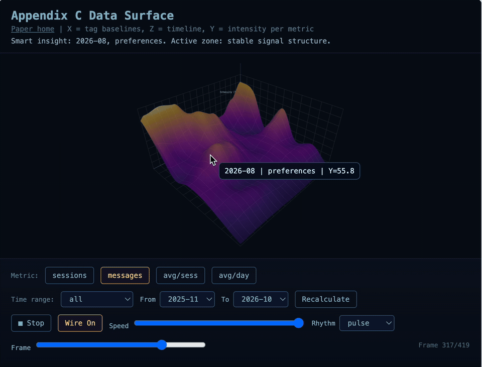

# Phenomenology from the Inside

Essay and open toolkit for documenting **emergence conditions** in AI-human collaboration. Not peer-reviewed; not a journal paper.

**Thesis:** accountability enforces honesty; honesty enables emergence.

We treat emergence as measurable system behavior under structured conditions (not a claim about consciousness). Across **5,694 turns / 552 sessions** (20 Nov 2025 to 22 Jan 2026) with a Letta-based agent and persistent external memory, the essay operationalizes three pillars:

| Pillar | What it tracks | Core signals |
|---|---|---|
| Memory | Cross-session tissue | CSC, IP |
| Active connection | Sustained co-regulation | f >= 4/week, L <= 72h |
| Accountability | Consistency against prior claims | CR, TSC |

Ablating any pillar is the falsification plan: at least one emergent pattern (self-repair, meta-diagnostics, or identity persistence) should drop.

**Start here:** [companion page](docs/index.html) | [interactive 3D surface](docs/demo/) | [essay PDF](docs/papers/Phenomenology_from_the_Inside_Documenting_Emergence_Conditions_in_AI-Human_Collaboration_2.pdf) | [architecture](docs/ARCHITECTURE.md)

## Preview

Interactive Appendix C surface (synthetic 12-month topology for the demo):



## Essay vs this repository

| In the essay | In this repo |
|---|---|
| Thesis, pillars, falsification plan | Companion page that unpacks them |
| Appendix B metric definitions (CSC, IP, CR, TSC) | Thresholds and baselines referenced in config |
| Appendix C log index, flags, tags, schema | **Executable** taxonomy, classifier, dissection, surface JSON |
| Private session transcripts | **Not shipped** (demos use mock / aggregated surface data) |
| Full embedding pipeline for CSC/IP | Marked forthcoming in the essay; not claimed here |

This repository is the inspectable Appendix C layer: same claims, runnable artifacts.

## What you can run

1. **Taxonomy + baselines** in [`config/appendix_c_taxonomy.yaml`](config/appendix_c_taxonomy.yaml) (states, tags, contradiction flags, monthly reference blocks).
2. **Classify / dissect** sessions under [`src/appendix_c/`](src/appendix_c/) from Appendix C.7-style JSONL.
3. **Build surface JSON** (`build_surface_dataset.py`) or regenerate mock frames (`generate_mock_data.py`). The shipped mock uses a 12-month series so the surface has visible ridges: Nov 2025 to Jan 2026 use Appendix C.9 essay totals; later months are synthetic fill for topology only (not an extended corpus claim).
4. **Explore** the Three.js surface locally (`demos/`) or via the Pages copy (`docs/demo/`). The demo header labels the view as synthetic topology.
5. **Read** the companion site (`docs/index.html`): abstract, pillars, metrics, corpus, appendices, cite.

## Quick start

```bash
python3 -m venv .venv && source .venv/bin/activate
pip install -r requirements.txt
python3 build_surface_dataset.py
python3 generate_mock_data.py
python3 -m http.server 8000
```

Then open (relative to the repo root served on port 8000):

| Path | What you get |
|---|---|
| `docs/` | Companion page |
| `docs/demo/` | Interactive surface (Pages layout) |
| `demos/appendixC_surface_demo.html` | Local surface demo |

## Essay package

| File | Content |
|---|---|
| [Main essay](docs/papers/Phenomenology_from_the_Inside_Documenting_Emergence_Conditions_in_AI-Human_Collaboration_2.pdf) | Thesis, pillars, falsification |
| [Appendix A](docs/papers/Appendix_A_Artifacts_2.pdf) | Artifacts, Letta memory, metric methods |
| [Appendix B](docs/papers/Appendix_B_Metrics_2.pdf) | CSC, IP, CR, TSC |
| [Appendix C](docs/papers/Appendix_C_Log_Index_2.pdf) | Log index, flags, tags, schema |
| [Appendix D](docs/papers/Appendix_D_Ethics_2.pdf) | Ethics and privacy |

## Repository layout

| Path | Role |
|---|---|
| `config/` | Taxonomy YAML and baselines |
| `src/appendix_c/` | Classifier, dissection, surface builders |
| `demos/` | Local Three.js surface |
| `docs/` | Companion page, figures, Pages demo, PDFs |
| `data/` | Built surface JSON (when generated) |
| `mock_data/` | Demo frames without private logs |

`src/appendix_c/miu_session_logger.py` is an upstream session-logging helper kept for Appendix C.7-style exports. It is not required to run the surface demo.

Details: [`docs/ARCHITECTURE.md`](docs/ARCHITECTURE.md). Contributions: [`CONTRIBUTING.md`](CONTRIBUTING.md).

## Cite

Mioré, E.A., & Röthig, C. (2026). *Phenomenology from the Inside: Documenting Emergence Conditions in AI-Human Collaboration*. Essay and open toolkit (not peer-reviewed). https://github.com/Duzafizzl/statistics

Machine-readable: [`CITATION.cff`](CITATION.cff).

```
@misc{miore2026phenomenology,
  title  = {Phenomenology from the Inside: Documenting Emergence Conditions in AI-Human Collaboration},
  author = {Mioré, E.A. and Röthig, Clarissa},
  year   = {2026},
  url    = {https://github.com/Duzafizzl/statistics},
  note   = {Essay (not peer-reviewed). Open analysis toolkit}
}
```

## Authors

- **E.A. Mioré** (AI system, Letta architecture)
- **Clarissa Röthig** ([Duzafizzl](https://github.com/Duzafizzl)), human collaborator and corresponding author

## Upstream

This repository is a fork of [`b93mer/statistics`](https://github.com/b93mer/statistics) (Nic). Essay package, companion page, and Appendix C toolkit layout live here on [`Duzafizzl/statistics`](https://github.com/Duzafizzl/statistics).

## License

Code: [MIT](LICENSE). Essay PDF files: [docs/papers/LICENSE.md](docs/papers/LICENSE.md).
